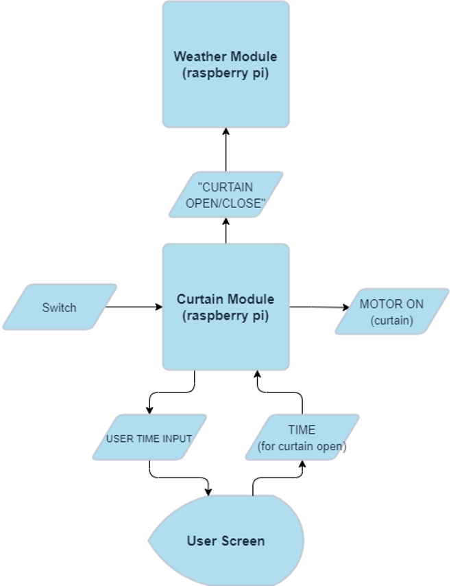

## Curtain Module
 * Module is subscribed to the TIME topic where the user sends information on desired curtain close/open time. 

 * Module connects to a circuit board with motors for the curtains using GPIO pins on the Raspberry Pi

 * Module uses time library so that curtain opens/closes at desired time and sends status message to weather module.

