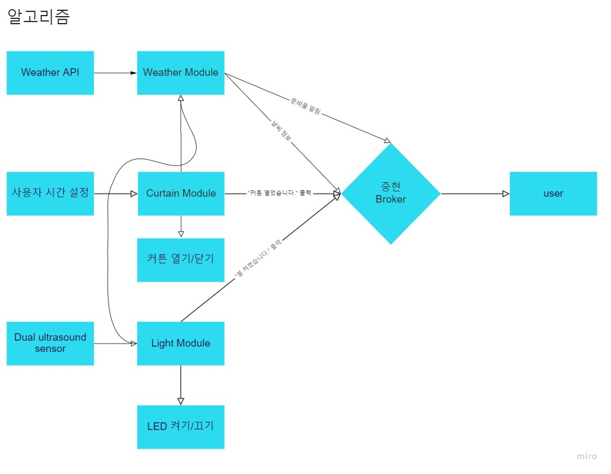

# Smart_home_Kosta
## IoT project: Smart home Service
Consists of a total of 4 modules:

1. Weather Module (Raspberry Pi)

    * Sends weather forecast and checklist based on weather to user.

2. Curtain Module (Raspberry Pi)

    * User can set a times when the curtain open and closes.

3. Light module (Arduino ESP32)
    
    * LED turn off when user leaves the house and on when user enters the house.

    * Arduino ESP32 is used

4. User (windows terminal)

    * Status messages show on this module.

 
 

### Channels

* Modules send data across four different topics using MQTT protocol:

    * CRHouse/WEATHER: where the weather module sends weather forecast and checklist data to the user
    * CRHouse/CURTAIN: where the curtain module signals the weather module that the curtains have opened
    * CRHouse/LIGHT: where the light module signals the weather module that the light has turned off
    * CRHouse/COUNTRY: where the user sends country information for weather forecasting
    * TIME: where the user sets a time for the curtain module.

 
 
 

