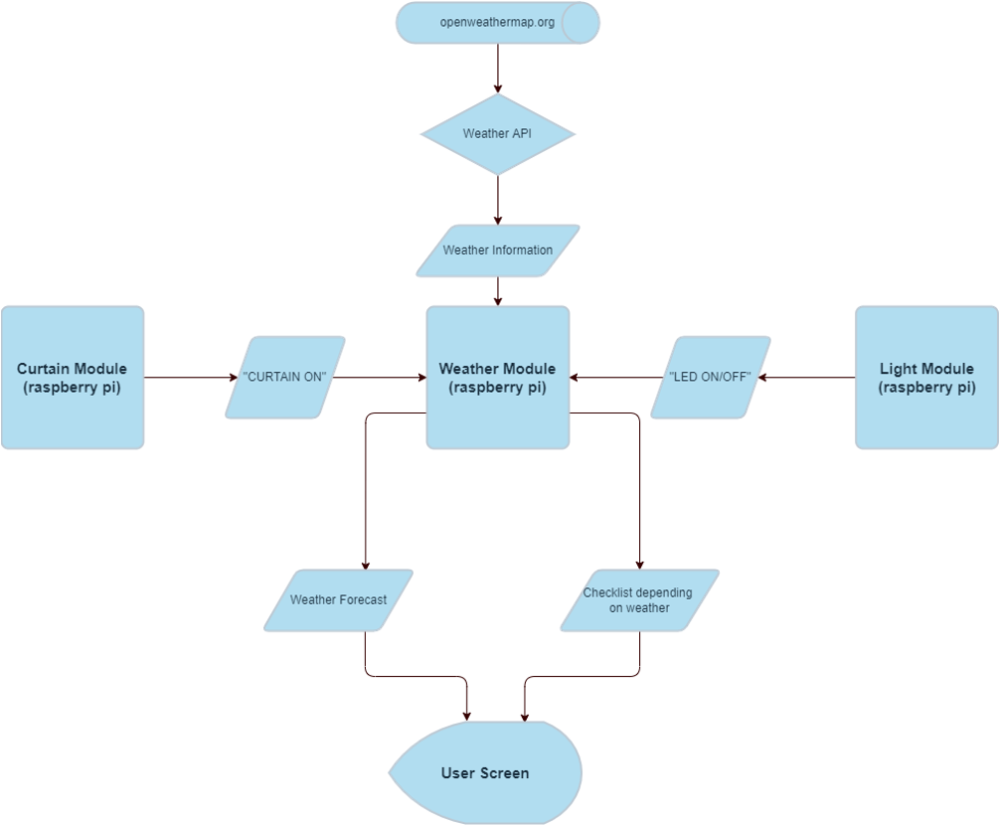

  
## Weather Module

* Uses weather-api to get weather forecast data of the area where the user lives (first inputted when module is turned on and connected to broker).

* When curtains open, user is sent a weather forecast for the day (alarm can be set on curtain module)

* When lights turn off e.g. the user leaves the house, the user is sent a checklist based on the weather.

